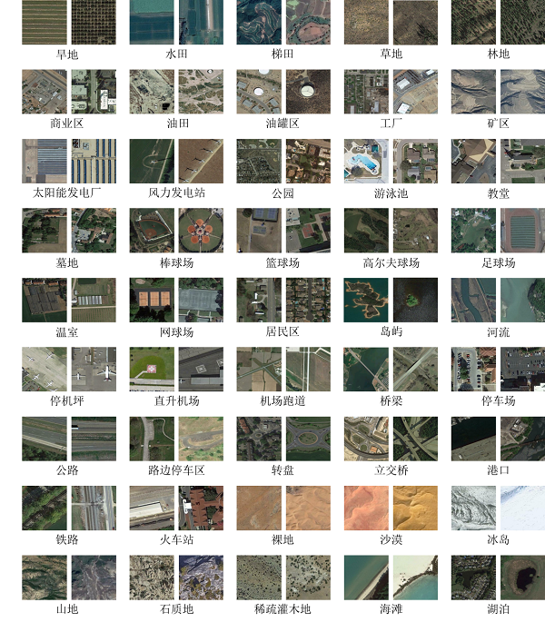
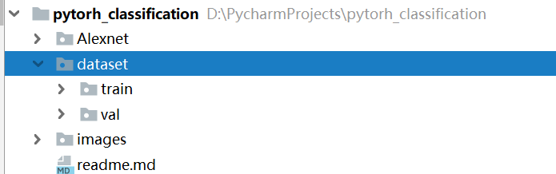
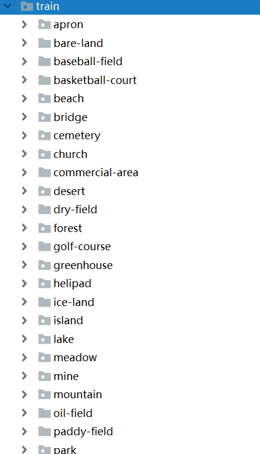
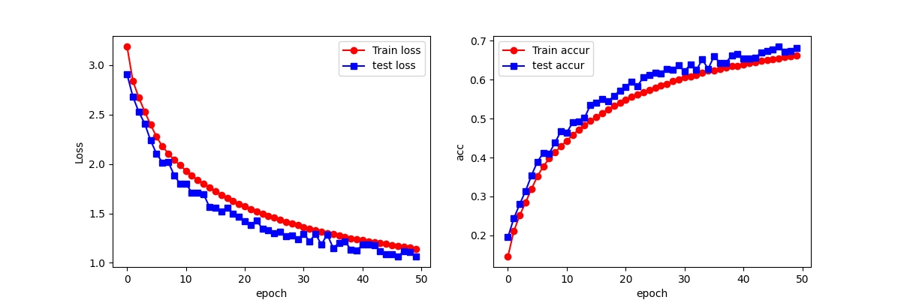
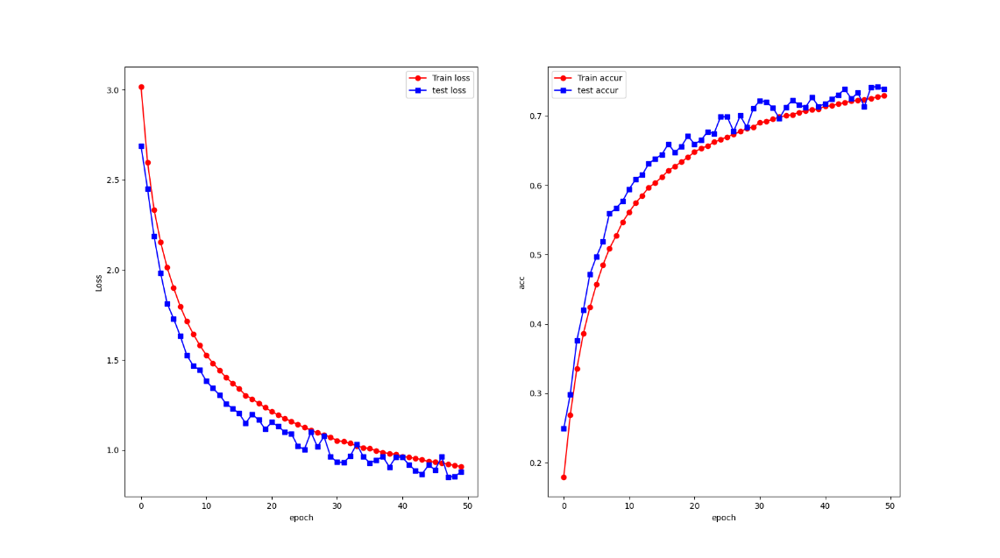
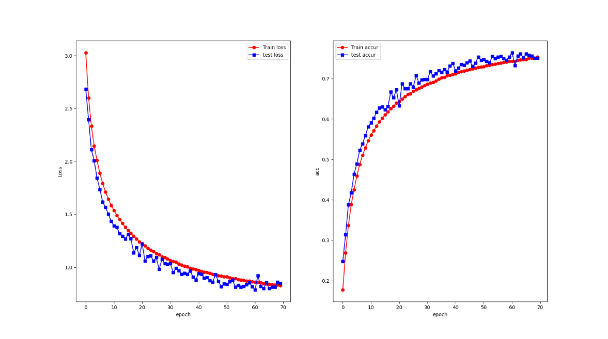
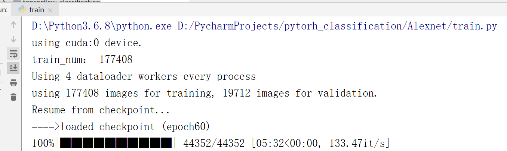
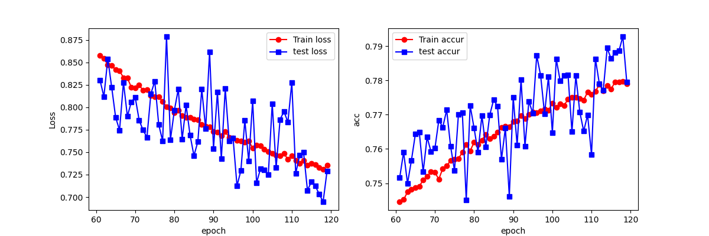
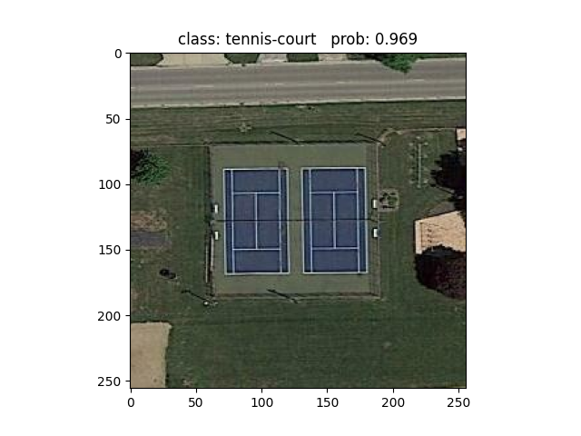
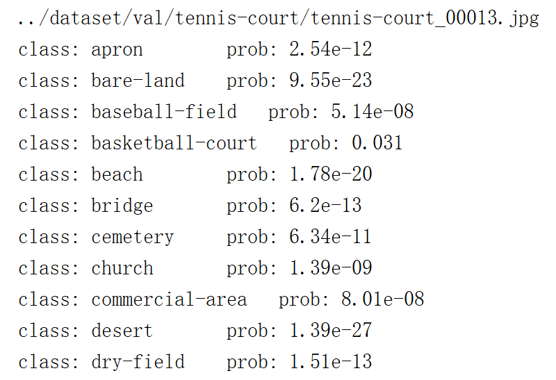

# 基于卷积神经网络AlexNet的遥感图像场景分类算法

## 卷积神经网络AlexNet

AlexNet模型是一个只用8层的卷积神经网络，有5个卷积层，3个全连接层，在每一个卷积层中包含了一个激活函数ReLU，这也是ReLU激活函数首次应用以及局部响应归一化处理，卷积计算后通过最大值池化层对特征映射进行降维处理。

AlexNet网络中输入为RGB图像，卷积核或者池化核的移动步长为4，在AlexNet中卷积层使用的卷积核从11逐渐减小为3，最后三个卷积层使用的卷积核为3×3。两个全连接层分别包含4096个神经元，最后的输出层使用softmax分类器，包含1000个神经元。

## 数据集介绍

数据集中包含多个类别场景的遥感图像场景，场景类型和标签包括：旱地 (1)、水田 (2)、梯田 (3)、草地 (4)、林地 (5)、商业区 (6)、油田 (7)、油罐区 (8)、工厂 (9)、矿区 (10)、太阳能发电厂 (11)、风力发电站 (12)、公园 (13)、游泳池 (14)、教堂 (15)、墓地 (16)、棒球场 (17)、篮球场 (18)、高尔夫球场 (19)、足球场 (20)、温室 (21)、网球场 (22)、居民区 (23)、岛屿 (24)、河流 (25)、停机坪 (26)、直升机场 (27)、机场跑道 (28)、桥梁 (29)、停车场 (30)、公路 (31)、路边停车区 (32)、转盘 (33)、立交桥 (34)、港口 (35)、铁路 (36)、火车站 (37)、裸地 (38)、沙漠 (39)、冰岛 (40)、山地 (41)、石质地 (42)、稀疏灌木地 (43)、海滩 (44)、湖泊 (45)。如下图所示，展示了本项目数据集各类别场景样本。



数据集中包含45个典型场景类别，分为训练集和测试集。其中训练集包含了177408张图像，训练集包含19712张图像

因为数据集较大，所以没有上传，可去网盘自取

链接：https://pan.baidu.com/s/1AzvB-FU-ZNLrbG-mEP-6CA 
提取码：oequ

解压后放入到项目中，目录如下，其中train是训练集，val是测试集



train文件部分内容展示如下，其中apron中全是机场类别的数据，以此类推




## 网络结构

程序中定义的AlexNet网络结构有5个卷积层、3个全连接层和3个最大池化层。输入图像的大小为[3，120，120]，第一层卷积核设置为11×11，输出通道设为48，步长为4，填充值为2。第二层卷积层卷积核设置为5×5，输出通道设为128，默认步长，padding值为2。最后三层卷积层的卷积核设置为3×3，输出通道分别为192、192、168。3个最大池化层的结构均为3×3，步长为2。最后三层全连接层分别包含了2048、1024和45个神经元。每经过一层卷积后，都会使用激活函数ReLU，其函数解析式为：
$$
ReLU = max(0, x)
$$
激活函数因为其非线性的特征，使得模型可以逼近任意函数，更加适应非线性的问题。ReLU是在搭建神经网络时优先考虑的激活函数，它使一部分神经元输出为0，造成了网络的稀疏性，缓解了过拟合问题的发生。

## 损失函数

损失函数用来表现预测与实际数据的差距程度，损失函数越小，模型的鲁棒性越好。本程序使用的损失函数为交叉熵损失CrossEntropyLoss，是pytorch中常用的多分类问题的损失函数，其函数解析式为：
$$
H(p,q) = -\sum\limits_{i=1}^np(x_{i})log(q(x_{i}))
$$
交叉熵刻画的是两个概率分布之间的距离，p代表正确答案，q代表的是预测值。

## 代码介绍

算法使用python实现，使用的环境为：python3.6.8、pycharm2018.3.7、cuda10.1，使用的python第三方库为torch1.8.0+cu111、matplotlib3.3.4、torchvision0.9.1+cu111、tqdm4.64.1等。

程序共包含4个文件，分别为model.py、train.py、predict.py和class_indices.json。

### model.py

model文件文件中定义了AlexNet网络结构，主要代码如下：

```python
class AlexNet(nn.Module):
    def __init__(self):
        super(AlexNet, self).__init__()
        self.model = nn.Sequential(
            # input[3, 120, 120]  output[48, 55, 55]
            nn.Conv2d(3, 48, kernel_size=11, stride=4, padding=2),
            nn.ReLU(inplace=True),
            nn.MaxPool2d(kernel_size=3, stride=2),              # output[48, 27, 27]
            nn.Conv2d(48, 128, kernel_size=5, padding=2),       # output[128, 27, 27]
            nn.ReLU(inplace=True),
            nn.MaxPool2d(kernel_size=3, stride=2),              # output[128, 13, 13]
            nn.Conv2d(128, 192, kernel_size=3, padding=1),      # output[192, 13, 13]
            nn.ReLU(inplace=True),
            nn.Conv2d(192, 192, kernel_size=3, padding=1),      # output[192, 13, 13]
            nn.ReLU(inplace=True),
            nn.Conv2d(192, 128, kernel_size=3, padding=1),      # output[128, 13, 13]
            nn.ReLU(inplace=True),
            nn.MaxPool2d(kernel_size=3, stride=2),                  # output[128, 6, 6]
            nn.Flatten(),
            # 防止过拟合，表示下面的神经元有0.5的概率不被激活
            nn.Dropout(p=0.5),
            nn.Linear(512, 2048),
            nn.ReLU(inplace=True),
            nn.Dropout(p=0.5),
            nn.Linear(2048, 1024),
            nn.ReLU(inplace=True),
            nn.Linear(1024, 45),
        )

    def forward(self, x):
        x = self.model(x)
        return x
```

### train.py

train.py文件实现了数据加载、数据预处理、训练、以及保存模型文件的功能。下面对各个模块功能的主要代码实现做具体介绍。

#### 图像加载与预处理

```python
data_transform = {
        "train": transforms.Compose([transforms.RandomResizedCrop(120),
                                     transforms.RandomHorizontalFlip(),
                                     transforms.ToTensor(),
                                     transforms.Normalize((0.5, 0.5, 0.5), (0.5, 0.5, 0.5))]),
        "val": transforms.Compose([transforms.Resize((120, 120)),
                                   transforms.ToTensor(),
                                   transforms.Normalize((0.5, 0.5, 0.5), (0.5, 0.5, 0.5))])}

data_root = os.path.abspath(os.path.join(os.getcwd(), "../"))  # get data root path
image_path = os.path.join(data_root, "dataset")
assert os.path.exists(image_path), "{} path does not exist.".format(image_path)
train_dataset = datasets.ImageFolder(root=os.path.join(image_path, "train"),
                                         transform=data_transform["train"])
```

加载train文件夹下的训练集图片和val文件夹下的测试集图片，将输入图片转化为120×120的输入特征图，并对图像进行随机水平翻转和归一化。Transform.ToTensor()将图像灰度范围从0-255变换到(0, 1)，transform.Normalize()则把(0, 1)变换到(-1, 1)

#### 进行标签到索引的映射

```python
image_list = train_dataset.class_to_idx
cla_dict = dict((val, key) for key, val in image_list.items())
    # write dict into json file
json_str = json.dumps(cla_dict, indent=4)
with open('class_indices.json', 'w') as json_file:
    json_file.write(json_str)
```

将英文分类标签映射为数值0到45，并写入json文件中

#### 对数据集进行batch划分

```python
batch_size = 4
nw = min([os.cpu_count(), batch_size if batch_size > 1 else 0, 8])

train_loader = torch.utils.data.DataLoader(train_dataset,
                                           batch_size=batch_size, shuffle=True,
                                           num_workers=nw)

validate_dataset = datasets.ImageFolder(root=os.path.join(image_path, "val"),
                                        transform=data_transform["val"])
val_num = len(validate_dataset)
validate_loader = torch.utils.data.DataLoader(validate_dataset,
                                              batch_size=batch_size, shuffle=False,
                                              num_workers=nw)
```

batch_size指批处理大小，代表一次性载入多少数据进行训练，一般设定为2的倍数，如128、64、16、8、4等。当数据集比较小时，可以采取全数据集训练的方式，跑完一次epoch所需的迭代次数能够减少。但由于本项目使用的训练集达到17万的量级，受限于电脑内存和显存，程序中只能将batch_size设定为4，即每一轮载入44352张图片进行训练和验证。

#### 启动模型，设定模型需要的参数

```python
device = torch.device("cuda:0" if torch.cuda.is_available() else "cpu")
net = AlexNet()
net.to(device)
# 设置训练需要的参数，epoch、学习率、优化器、损失函数
loss_function = nn.CrossEntropyLoss()           # 交叉熵损失，pytorch中常用多分类问题的损失函数
learning = 0.00001
optimizer = optim.Adam(net.parameters(), lr=learning)
epochs = 120
save_path = './AlexNet.pth'
# 复制模型的参数
best_model_wts = copy.deepcopy(net.state_dict())
best_acc = 0.0
train_steps = len(train_loader)
# 设置四个空数组，用来存放训练集的loss和accuracy，测试集的loss和accuracy
train_loss_all = []
train_accur_all = []
test_loss_all = []
test_accur_all = []
```

学习率是深度学习中的一个重要的参数，它控制着基于损失梯度调整神经网络权值的速度。学习率越小，损失梯度下降的越慢，收敛的时间更长。为了更直观的观察学习率对收敛速度的影响，本文实验了不同学习率下，训练相同的epoch，可视化出模型loss和acc收敛过程，如图所示。



​                                                                                    lr = 0.000005



​                                                                                     lr = 0.00001

从上面两个图可以清晰地看出，同样训练50轮，当学习率设为0.000005时，最后收敛到的准确度约为0.67左右，而当学习率设为0.00001时，收敛到的准确度约为0.74，后者的收敛速度明显比前者的快。但观察到，在接近50轮，acc还在缓步增长，loss值还在缓慢下降，说明模型还没有完全收敛，应该继续增加epoch的值。最终正式训练时，学习率设定为0.00001。

设置四个空数组，用于保存每轮训练和验证的loss、acc值，用于训练结束后，进行可视化。

#### 训练与验证

```python
train_flag = True
start_epoch = 0
# 若train_flag为True，则加载已保存的模型
if train_flag:
    if os.path.isfile(save_path):
        print("Resume from checkpoint...")
        checkpoint = torch.load(save_path)
        net.load_state_dict(checkpoint['model_state_dict'])
        optimizer.load_state_dict(checkpoint['optimizer_state_dict'])
        start_epoch = checkpoint['epoch']+1
        print("====>loaded checkpoint (epoch{})".format(checkpoint['epoch']))
    else:
        print("====>no checkpoint found.")
        start_epoch = 0
        print('无保存模型，将从头开始训练！')
```

程序中实现了断点续训的功能，即保存上次训练的最佳模型参数，在下次训练时，加载上次训练的模型参数，继续上次的epoch后训练。因为经过多次训练，观察到训练50轮模型仍未完全收敛，但一次跑50轮以上需要耗费大量时间，实现了断点续训练后，使得训练更加容易实现。

```python
for epoch in range(start_epoch, epochs):
    train_loss = 0.0
    train_num = 0.0
    train_accuracy = 0.0
    net.train()
    train_bar = tqdm(train_loader, file=sys.stdout)
    for step, data in enumerate(train_bar):
        images, labels = data
        optimizer.zero_grad()   # 每个迭代步数的梯度初始化为0
        outputs = net(images.to(device))
        loss1 = loss_function(outputs, labels.to(device))
        outputs = torch.argmax(outputs, 1)
        loss1.backward()        # 损失的反向传播，计算梯度
        optimizer.step()        # 使用梯度进行优化
        # train_loss_steps.append(loss1.item())
        # 计算每经过print_step次迭代后的输出
        train_loss += abs(loss1.item()*images.size(0))
        accuracy = torch.sum(outputs == labels.to(device))
        train_accuracy = train_accuracy + accuracy
        train_num  += images.size(0)
        print("train epoch[{}/{}] train-loss:{:.3f} train-accuracy:{:.3f}".format(epoch + 1, epochs,                                                                                       train_loss/train_num, train_accuracy/train_num))
        train_loss_all.append(train_loss/train_num)
        train_accur_all.append(train_accuracy/train_num)
        #开始测试
        test_loss = 0.0
        test_accuracy = 0.0
        test_num = 0
        net.eval()
        with torch.no_grad():       # 禁止梯度计算
            val_bar = tqdm(validate_loader, file=sys.stdout)
            for val_data in val_bar:
                val_images, val_labels = val_data
                outputs = net(val_images.to(device))
                loss2 = loss_function(outputs, val_labels.to(device))
                outputs = torch.argmax(outputs, 1)
                # test_loss_steps.append(loss2.item())
                test_loss = test_loss+abs(loss2.item()*images.size(0))
                accuracy = torch.sum(outputs == val_labels.to(device))
                test_accuracy = test_accuracy + accuracy
                test_num += images.size(0)
                print('[epoch %d] test_loss: %.3f  test_accuracy: %.3f'%
                      (epoch + 1, test_loss / test_num, test_accuracy/test_num))
                test_loss_all.append(test_loss/test_num)
                test_accur_all.append(test_accuracy/test_num)
                # 拷贝模型最高精度下的参数
                if test_accur_all[-1] > best_acc:
                    best_acc = test_accur_all[-1]
                    # best_model_wts = copy.deepcopy(net.state_dict())
                    checkpoint = {"model_state_dict": net.state_dict(),
                                  "optimizer_state_dict": optimizer.state_dict(),
                                  "epoch": epoch}
                    path_checkpoint = save_path
                    # 保存断点
                    torch.save(checkpoint, path_checkpoint)
```

#### 可视化训练结果

```python
plt.figure(figsize=(12, 4))
plt.subplot(1, 2, 1)
plt.plot(range(start_epoch, epochs), train_loss_all,
         "ro-", label="Train loss")
plt.plot(range(start_epoch, epochs), test_loss_all,
         "bs-", label="test loss")
plt.legend()
plt.xlabel("epoch")
plt.ylabel("Loss")
plt.subplot(1, 2, 2)
plt.plot(range(start_epoch, epochs), train_accur_all,
         "ro-", label="Train accur")
plt.plot(range(start_epoch, epochs), test_accur_all,
         "bs-", label="test accur")
plt.xlabel("epoch")
plt.ylabel("acc")
plt.legend()
plt.show()
```

### predict.py

predict.py为预测文件，实现了对测试集图像的预测。在预测前，需要载入测试集图像数据，对图像进行归一化，与train文件中的图像加载和处理过程类似，此处不再过多赘述。

```python
device = torch.device("cuda:0" if torch.cuda.is_available() else "cpu")
data_transform = transforms.Compose(
    [transforms.Resize((120, 120)),
     transforms.ToTensor(),
     transforms.Normalize((0.5, 0.5, 0.5), (0.5, 0.5, 0.5))])

# load image
img_path = "../dataset/val/tennis-court/tennis-court_00013.jpg"
assert os.path.exists(img_path), "file: '{}' dose not exist.".format(img_path)
print(img_path)
img = Image.open(img_path)
plt.imshow(img)
img = data_transform(img)
# expand batch dimension
img = torch.unsqueeze(img, dim=0)

# read class_indict
json_path = './class_indices.json'
assert os.path.exists(json_path), "file: '{}' dose not exist.".format(json_path)

with open(json_path, "r") as f:
    class_indict = json.load(f)
    # create model
    model = AlexNet().to(device)
    # load model weights
    weights_path = "./AlexNet.pth"
    assert os.path.exists(weights_path), "file: '{}' dose not exist.".format(weights_path)
    checkpoint = torch.load(weights_path)
    model.load_state_dict(checkpoint['model_state_dict'])
    model.eval()

    with torch.no_grad():
        # predict class
        output = torch.squeeze(model(img.to(device))).cpu()
        predict = torch.softmax(output, dim=0)
        predict_cla = torch.argmax(predict).numpy()

        print_res = "class: {}   prob: {:.3}".format(class_indict[str(predict_cla)],
                                                     predict[predict_cla].numpy())
        plt.title(print_res)
        for i in range(len(predict)):
            print("class: {:10}   prob: {:.3}".format(class_indict[str(i)],
                                                      predict[i].numpy()))
        plt.show()
```

torch.load()加载模型训练后保存的断点，接着从断点中获取保存的model_state_dict进行加载。model.eval()进入预测模式。将待预测的图片img放入模型中进行预测，使用softmax函数将张量的每个元素缩放到区间(0, 1)且和为1，这样就能输出模型预测该图像对应45类标签的概率。最后使用torch.argmax()函数取出最大的概率，即为该图片的预测分类。

## 算法结果

训练70轮后，可视化出训练过程loss和acc的值，如下图所示



从图中可以看出，在接近70轮时，loss值仍在缓慢下降，acc值仍在缓慢上升，模型仍未完全收敛，还有提升的空间。于是，从保存的断点处继续训练，将epoch值设为120，如图7所示，程序成功加载了上轮训练的最佳参数模型，即从第60轮继续开始训练



当120轮训练结束后，程序可视化出第60轮至120轮的loss和acc值。从图中可以看出，train_accur缓慢上升，test_acc波动上升，测试准确度最终在0.78左右。train_loss和test_loss最终均下降到了0.75以下。如图所示



下图所示的是具体图片的预测结果。将val测试集文件夹下属于tennis-court分类下的一张图片放入模型中进行预测，可视化出该图像，并成功显示该图像所属分类及概率。同时，控制台中输出该图像所属各个分类的概率，下图展示了部分输出。





## 结果分析与展望

因为时间有限，目前训练出的模型在测试集上的精准度只能达到0.78左右，后续会继续完善，争取能够继续提升精准度。同时，针对测试样本预测结果，计划使用混淆矩阵表示，并将其可视化，观察其在每类数据上的预测情况，以便能够更加直观的看出模型在各个类别上预测效果的优劣。