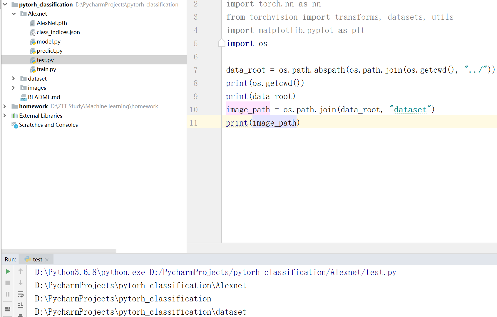
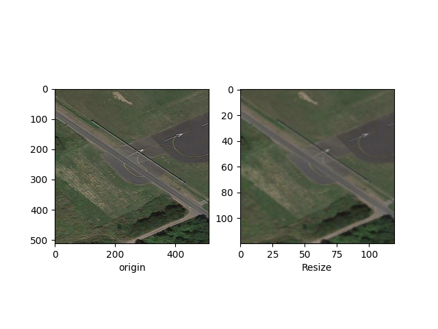
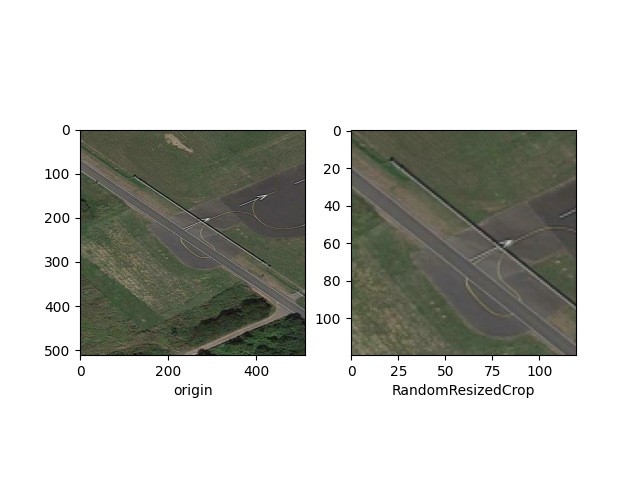
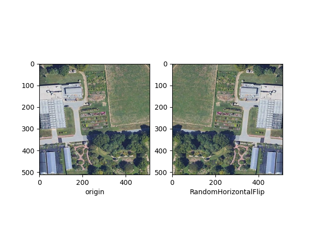
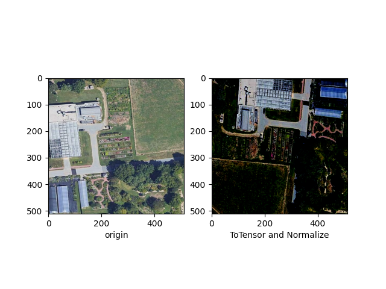

# 机器学习大作业函数介绍

## os库

os常用于路径操作，os.path子库处理文件路径及信息

**os.path.abspath(path)**返回path在当前系统中的绝对路径

**os.path.join(path, paths)**组合path与paths，返回一个路径字符串

**os.getcwd()**获取当前路径



## torchvision库

torchvision是pytorch的一个图形库，服务于pytorch的深度学习框架，主要用来构建计算机视觉模型

**torchvision.datasets**：加载数据的函数

**torchvision.models**：包含常用的模型结构（含预训练模型）

**torchvision.transforms**：常用的图形变换，例如裁剪、旋转等

### torchvision.datasets读取文件路径，返回训练数据与标签

```python
dataset=torchvision.datasets.ImageFolder(
                       root, transform=None, 
                       target_transform=None, 
                       loader=<function default_loader>, 
                       is_valid_file=None)


```

参数详解：

**root**：图片存储的根目录，即各类别文件夹所在目录的上级目录

**transform**：对图片进行预处理操作的函数

**target_transform**：对图像类别进行预处理的函数，输入为target，输出对其进行的变换，如果不传该参数，								  即对target不做任何变换，返回的顺序索引为0、1、2...

**loader**：数据集加载方式，通常默认加载方式

**is_valid_file**：获取图像文件的路径并检查文件是否为有效文件（是否损坏）

返回的dataset都三个属性：

**self.classes**：用list保存类别名称

**self.class_to_index**：类别对应的索引

**self.img**：保存(img-path，class)元组的list

**self.targets**：返回文件夹中的文件类别

### torchvision.transforms

**transforms.Resize(size)**：将图片缩放成size*size大小

**transforms.RandomResizedCrop(size)**：将原图随机裁剪一块，再缩放成size*size大小

**transforms.RandomHorizontalFlip()**：将原图随机水平翻转

**transforms.ToTensor()**：将输入图像的shape W,H,C->C,W,H，即图片原本通道在第三维，变为第一维的  											   torch image类型。将所有的数除以255，将数据归一化到[0, 1]

**trainsforms.Normalize()**：数据标准化（均值变为0，标准差变为1），加速模型收敛









## torch.utils.data.DataLoader数据加载器

torch.utils.data.DataLoader主要对数据进行batch划分

```python
train_loader = torch.utils.data.DataLoader(dataset=train_dataset,
                                           batch_size=batch_size,
                                           shuffle=True,
                                           num_workers=nw)
```

参数详解：

dataset：torch TensorDataset 格式的数据集

batch_size：批处理大小

shuffle：每次迭代前是否打乱数据，值为True意为打乱数据

num_workers：读数据的线程数

## from sklearn.metrics import accuracy_score

**accuracy_score(y_true, y_pre, normalize)**函数衡量分类器分类准确率

参数详解：

y_true：真实标签，二分类和多分类情况下是一列

y_pre：预测标签，二分类和多分类情况下是一列

normalize：bool型，值为True则表示计算正确分类的样本比例，否则表示正确分类的样本数

eg.

```python
import numpy as np
from sklearn.metrics import accuracy_score
y_pred = [0, 2, 1, 3]
y_true = [0, 1, 2, 3]
accuracy_score(y_true, y_pred)
#0.5
accuracy_score(y_true, y_pred, normalize=False)
#2
```

## from sklearn.metrics import confusion_matrix

confusion_matrix混淆矩阵，是总结分类模型的情况分析表

confusion_matrix（y_true, y_pre）

混淆矩阵可视化

```python
conf_mat = confusion_matrix(test_data_y, pre_lab_list)
class_label = validate_dataset.classes
class_label[0] = "apron"
df_cm = pd.DataFrame(conf_mat, index=class_label, columns=class_label)
plt.figure(figsize=(20, 25))
heatmap = sns.heatmap(df_cm, annot=True, fmt="d", cmap="YlGnBu")
heatmap.yaxis.set_ticklabels(heatmap.yaxis.get_ticklabels(), rotation=0, ha="right")
heatmap.xaxis.set_ticklabels(heatmap.xaxis.get_ticklabels(), rotation=45, ha="right")
plt.ylabel("True label")
plt.xlabel("Predicted label")
plt.subplots_adjust(bottom=0.2)
plt.show()
```

## from sklearn.metrics import classification_report

sklearn中的classification_report函数用于显示主要分类指标的文本报告．在报告中显示每个类的精确度，召回率，F1值等信息

用法示例：

```python
from sklearn.metrics import classification_report
y_true = [0, 1, 2, 2, 2]
y_pred = [0, 0, 2, 2, 1]
target_names = ['class 0', 'class 1', 'class 2']
print(classification_report(y_true, y_pred, target_names=target_names))
```

输出

```python
               precision    recall  f1-score   support

    class 0       0.50      1.00      0.67         1
    class 1       0.00      0.00      0.00         1
    class 2       1.00      0.67      0.80         3

    accuracy                          0.61         5
    macro avg     1.00      0.67      0.80
    weighted avg  1.00      0.67      0.80
```

support为类别在测试集中的样本数

accuracy为整个测试集上的预测准确度

macro avg为宏平均，对所有类别的平均

weighted avg为加权平均，对宏平均的一种改进，考虑了每个类别样本数量在总样本中的占比